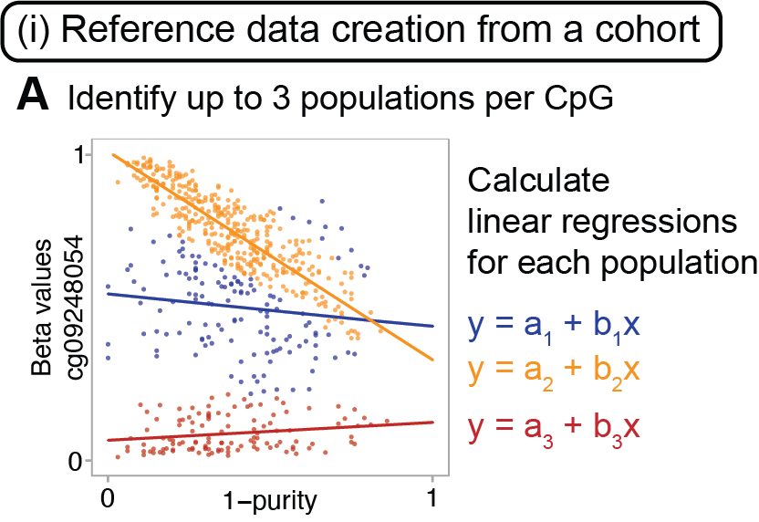
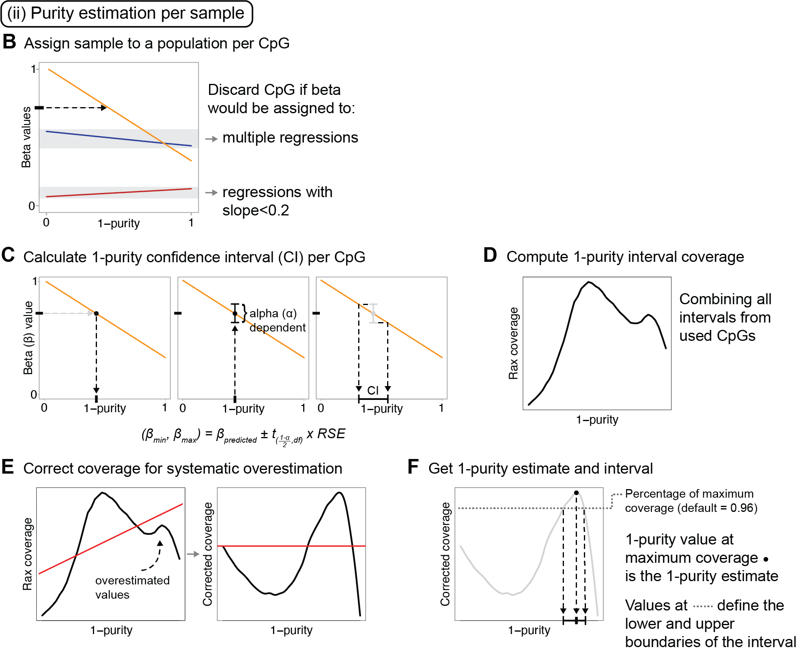
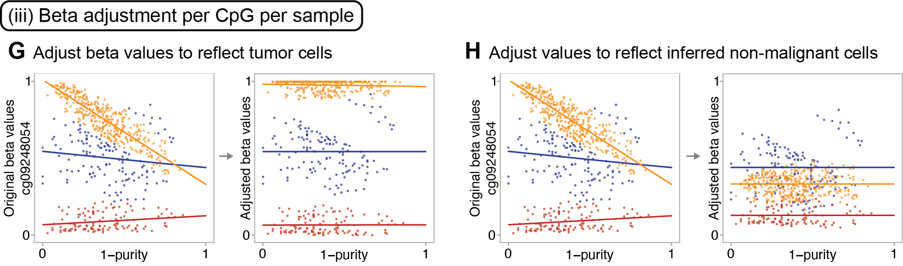

## PureBeta

<a href="https://staaflab.github.io/PureBeta/"></a>

Method for calculating tumor purity and adjusting Illumina 450/850K DNA methylation beta values. This work has been described in the article "**Tumor purity estimated from bulk DNA methylation can be used for adjusting beta values of individual samples to better reflect tumor biology**" published by [Sasiain, Nacer et al. in *JOURNAL*](LINK).

## How to install

```R
# Install devtools if you don't have it yet
install.packages("devtools")

# Load the library
library(devtools)

# Install and load PureBeta
install_github("StaafLab/PureBeta")
library(PureBeta)
```

> NOTE. Due to the included reference data the installation of the package may require more than 30 seconds. In case of reaching the installation timeout when installing the package consider changing the default timeout as follows:
``` R
# Updating the default timeout to 1000
options(timeout = 1000)
```

## Summary

Solid tumors are complex mixtures of tumor cells and non-malignant cells such 
as leukocytes and non-immune stromal cells. Consequently, DNA methylation data estimated
from tumor samples are a mixture of signals obtained from the malignant and
non-malignant sections of the tumor. Here we present PureBeta, an R package that allows
for the adjustment of DNA methylation beta values to account for the effect of sample
composition. This package allows for the correction of complete cohorts of samples with
known sample purities and CpG beta values, and for the estimation of sample purity and subsequent beta correction using reference data and uncorrected beta values of data sets (or single samples)
without known sample purities. 

## Framework
The PureBeta package is divided into four main functions:

1. *Correction of beta values from a cohort with known sample purities*: The function ***beta_correction_for_cohorts()*** performs beta value adjustment for tumor sample composition based on the original Staaf & Aine beta correction approach, correcting betas from a cohort of samples with known sample purities. More information about this approach can be found in the original publication: [Staaf & Aine, PLosOne, 2022](https://doi.org/10.1371/journal.pone.0265557).

2. *Creation of reference data from a cohort*: in the ***reference_regressions_generator()*** function, reference linear regressions are calculated based on DNA methylation beta values and tumor purity estimates of a cohort. Each regression represents a sample population as shown in the figure below.


</p>

3. *Estimation of tumor purities for individual samples*: in the ***purity_estimation()*** function, CpGs are first filtered based on beta variance removing those considered to be non-informative. Each CpG is then processed individually obtaining a sample purity interval. Finally, all the obtained intervals per sample are integrated generating a purity estimate for the sample.



4. *Adjustment of beta values per CpG and sample*: in the ***reference_based_beta_correction()*** function, beta values are adjusted for sample composition using reference regressions and estimated purities. This can be performed following two approaches: refitting the regressions to include the new data points (betas to correct + estimated purities) or using the original reference regressions. Unlike **beta_correction_for_cohorts()**, this function does not require the usage of a full cohort of samples, as it is applicable to a single sample and a single CpG. DNA methylation beta values and estimated purities for TCGA BRCA, LUAD, and LUSC samples are available on [FigShare](https://doi.org/10.6084/m9.figshare.26272864) for the refitting approach.



For more information on each of the functions, go to [our webpage](https://staaflab.github.io/PureBeta/) and click on Reference at the top of the page. 

## Data

This package includes precomputed reference regressions that model the correlation
between DNA methylation beta values and sample purities obtained from *The Cancer 
Genome Atlas* for three different cancer types: 

* Breast Cancer (BRCA)
* Lung Adenocarcinoma (LUAD) 
* Lung Squamous Cell Carcinoma (LUSC) 

Due to size limitations this files do not include all the parameters needed to run the bootstrapping based purity estimation. Those files are available in [FigShare](https://doi.org/10.6084/m9.figshare.26272864).

Additionally, it also includes small example data sets (purities and original beta values of a reference set with less samples, and original betas from a larger cohort) obtained from the 5000 most variable CpGs of the TCGA BRCA
data set to test the execution of the package's functions.

### License

The PureBeta R package is under the GPL-3.0 license. A copy of this license is included with the package.
