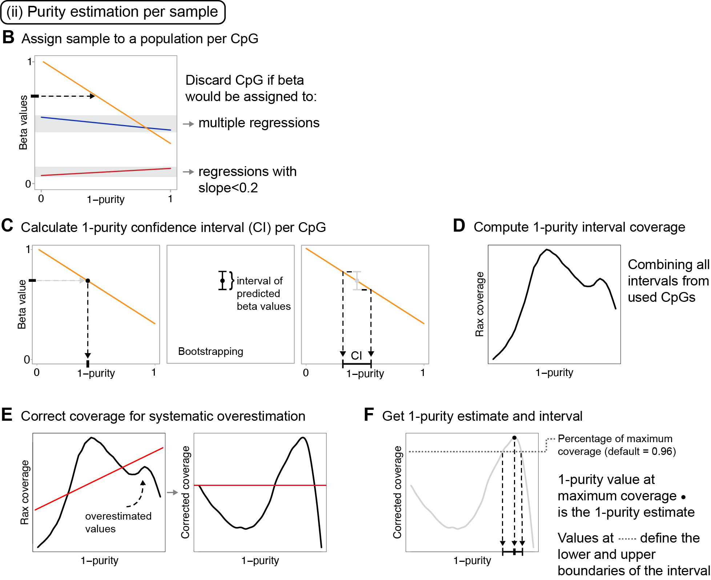

<font size="12">**PureBeta** </font>  <a href="https://staaflab.github.io/PureBeta/"></a>

Method for calculating tumor purity and adjusting Illumina 450/850K DNA methylation beta values. This work has been described in the article "**Tumor purity estimated from bulk DNA methylation can be used for adjusting beta values of individual samples to better reflect tumor biology**" published by [Sasiain, Nacer et al. in *JOURNAL*](LINK).

## How to install

```R
# Install devtools if you don't have it yet
install.packages("devtools")

# Load the library
library(devtools)

# Install and load PureBeta
install_github("StaafLab/PureBeta")
library(PureBeta)
```
## Summary

Solid tumous are complex mixtures of tumor cells, and non-malignant cells such 
as leukocytes or non-immune stromal cells. Consequently, DNA methylation estimated
from tumor samples is a mixture of the signal obtained from the malignant and
non-malignant section of the tumor. Here we present PureBeta, an R package that allows
for the adjustment of DNA methylation beta values to account for the effect of sample
composition. This package, allows for the correction of complete cohorts of samples with
known sample purities and CpG beta values and for the estimation of sample purity, and subsequent beta correction using reference data and uncorrected beta values of data sets (or single samples)
without known sample purities. 

## Framework
The PureBeta package is divided into four main functions:

1. *Correction of beta values from a cohort with known sample purities*: The function ***beta_correction_for_cohorts()*** performs beta value adjustment for tumor sample composition based on the original Staaf & Aine beta correction approch, correcting betas from a cohort of samples with known sample purities. More information about this approach can be found in the original publication: [Staaf & Aine, PLosOne, 2022](https://doi.org/10.1371/journal.pone.0265557).

2. *Creation of reference data from a cohort*: in the ***reference_regressions_generator()*** function, reference linear regressions are calculated based on DNA methylation beta values and tumor purity estimates of a cohort. Each regression represents a sample population as shown in the figure below.


</p>

3. *Estimation of tumor purities for individual samples*: in the ***purity_estimation()*** function, CpGs are first filtered based on beta variance removing the non-informatoive ones. Each CpG is then processed individually obtaining a sample purity interval. Finally, all the obtained intervals per sample are integrated obtaining a sample purity estimate.



4. *Adjustment of beta values per CpG and sample*: in the ***reference_based_beta_correction()*** function, beta values are adjusted for sample composition using reference regressions and estimated purities. This can be peformed following two approaches: refitting the regressions to include the new data points (betas to correct + estimated purities) or using the original reference regressions. Unlike **beta_correction_for_cohorts()**, this function does not require the usage of a full cohort of samples, as it is single sample and single CpG applicable.


## Data

This package includes precomputed reference regressions that model the correlation
between DNA methylation beta value and sample purities obtained from **The Cancer 
Genome Atlas** in three different cancer types: 

* Breast Cancer (BRCA)
* Lung Adenocarcinoma (LUAD) 
* Lung Squamous cell carcinoma (LUSC). 

Additionally, it also includes small example datsets (reference purities,
betas and betas to correct) obtained from the 5000 most variable CpGs in the TCGA-BRCA
dataset to test the execution of the package's functions.

### License

The PureBeta R package is under the GPL-3.0 license. A copy of this license is included with the R package.
